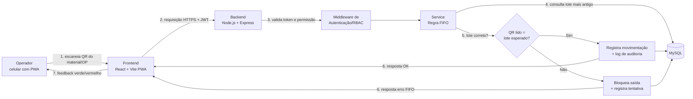

# Cristal Master — PWA Mobile para Almoxarifado e Controle FIFO

Aplicação web mobile (PWA) para descentralizar as movimentações do almoxarifado industrial, com leitura de QR Code e validação da regra **FIFO** (First In, First Out) no momento da saída de material.

## Integrantes

- Ithalo Willian Maximino da Silva
- Alexandre Fabricio Guenther
- Paulo Henrique Araujo da Silva e Silva

**Instituição:** SENAI/SC — Blumenau
**Repositório:** https://github.com/zIthalo/cristal-master

---

## Problema

No almoxarifado da Cristal Master, os pallets de resina (aprox. 1.000 kg) ficam em blocos compactos e fileiras profundas no chão. Sob pressão de tempo, os operadores retiram os pallets mais acessíveis e não os mais antigos, quebrando o FIFO. Além disso, as movimentações são registradas em fichas de papel e baixadas em lote no ERP (desktop), o que gera divergência entre o saldo virtual e o estoque real.

## Solução proposta

Um PWA usado no celular do operador, que:

1. Indica qual lote/posição deve ser retirado primeiro (antes da leitura).
2. Valida o QR Code lido contra a regra FIFO e bloqueia a saída fora de ordem.
3. Registra a movimentação instantaneamente, sem ficha de papel.

---

## Declaração de Escopo do MVP

### O que o sistema FAZ

| # | Funcionalidade |
|---|----------------|
| 1 | Login de usuário (JWT + Refresh Token) |
| 2 | Controle de permissões por perfil (Operador, Supervisor, Administrador) |
| 3 | Leitura de QR Code pela câmera do celular |
| 4 | Consulta de materiais |
| 5 | Consulta de lotes (com posição no piso e data de entrada) |
| 6 | Validação FIFO: indica o próximo lote a sair e bloqueia a saída de lote fora de ordem |
| 7 | Registro de saída de material vinculado a uma Ordem de Produção (OP) |
| 8 | Histórico de movimentações |
| 9 | Dashboard simples (ex.: saídas do dia, tentativas bloqueadas) |
| 10 | Log de auditoria das operações, incluindo tentativas de violação FIFO |

### O que o sistema NÃO FAZ (fora do escopo do MVP)

- Não integra com um ERP real. O PWA é a camada de captura; a integração é simulada por uma API própria com contrato bem definido. `[CONFIRMAR com a equipe/professor]`
- Não substitui o ERP nem faz gestão fiscal, financeira ou de compras.
- Não usa RFID nem hardware adicional (apenas a câmera do celular).
- Não possui dashboard preditivo de obsolescência.
- Não gerencia layout físico do piso de forma gráfica (a posição do lote é um endereço lógico, ex.: `F01`).
- Não prevê investimento em estrutura física (ex.: porta-pallets), conforme restrição do desafio.
- Funcionamento offline completo (fila local com sincronização em background) não faz parte do MVP; fica como melhoria futura. `[CONFIRMAR]`

### Restrições do desafio respeitadas

- **Uso exclusivo de dispositivos móveis:** sem dependência de desktop nem de papel.
- **Zero investimento em estrutura física:** o FIFO é apoiado por lógica organizacional (cada posição recebe um único lote) e pelo app.
- **Interface limpa e rápida:** telas simples, botões grandes, feedback visual verde/vermelho.

---

## Stack Técnica

| Camada | Tecnologia |
|--------|------------|
| Frontend | React, TypeScript, Vite, PWA |
| Backend | Node.js, Express, TypeScript |
| Banco de dados | MySQL |
| Autenticação | JWT, Refresh Token, bcrypt |
| Testes | Jest, Supertest |
| Versionamento | Git, GitHub |

---

## Diagrama de Blocos — Fluxo de Dados

---

## Como executar

> Será preenchido conforme o projeto evoluir (instalação, variáveis de ambiente, scripts de banco e testes).

## Estrutura de Documentação

- `AI_LOG.md` — diário de engenharia assistida por IA.
