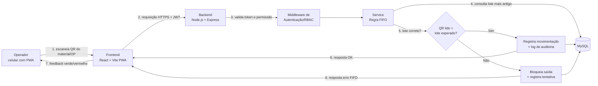
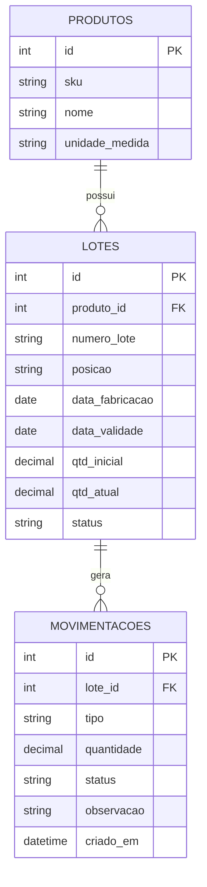
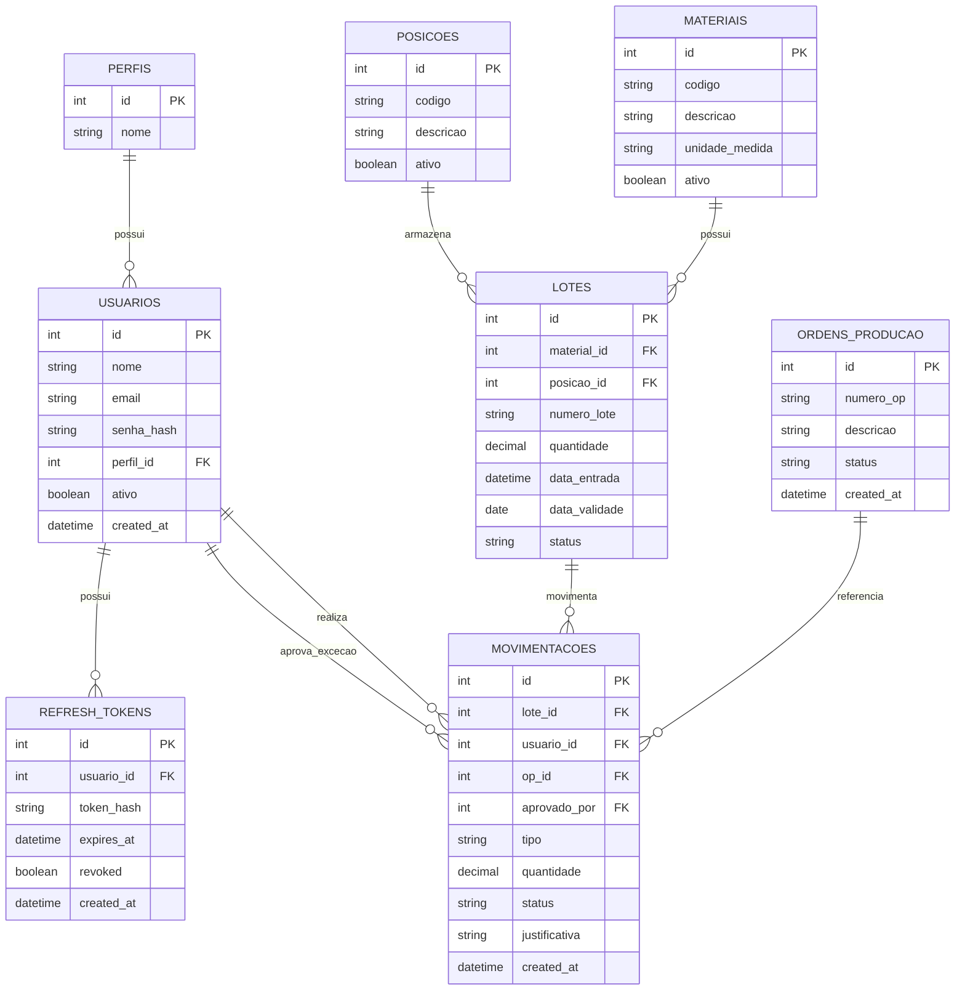

# Cristal Master — PWA Mobile para Almoxarifado e Controle FIFO

Aplicação web mobile (PWA) para descentralizar as movimentações do almoxarifado industrial, com leitura de QR Code e validação da regra **FIFO** (First In, First Out) no momento da saída de material.

## Integrantes

- Ithalo Willian Maximino da Silva
- Alexandre Fabricio Guenther
- Paulo Henrique Araujo da Silva e Silva

**Instituição:** UniSENAI Blumenau
**Repositório:** https://github.com/zIthalo/cristal-master

---

## Problema

No almoxarifado da Cristal Master, os pallets de resina (aprox. 1.000 kg) ficam em blocos compactos e fileiras profundas no chão. Sob pressão de tempo, os operadores retiram os pallets mais acessíveis e não os mais antigos, quebrando o FIFO. Além disso, as movimentações são registradas em fichas de papel e baixadas em lote no ERP (desktop), o que gera divergência entre o saldo virtual e o estoque real.

## Solução proposta

Um PWA usado no celular do operador, que:

1. Indica qual lote/posição deve ser retirado primeiro (antes da leitura).
2. Valida o QR Code lido contra a regra FIFO e bloqueia a saída fora de ordem.
3. Registra a movimentação instantaneamente, sem ficha de papel.

---

## Declaração de Escopo do MVP

### O que o sistema FAZ

| # | Funcionalidade |
|---|----------------|
| 1 | Login de usuário (JWT + Refresh Token) |
| 2 | Controle de permissões por perfil (Operador, Supervisor, Administrador) |
| 3 | Leitura de QR Code pela câmera do celular |
| 4 | Consulta de materiais |
| 5 | Consulta de lotes (com posição no piso e data de entrada) |
| 6 | Validação FIFO: indica o próximo lote a sair e bloqueia a saída de lote fora de ordem |
| 7 | Registro de saída de material vinculado a uma Ordem de Produção (OP) |
| 8 | Histórico de movimentações |
| 9 | Dashboard simples (ex.: saídas do dia, tentativas bloqueadas) |
| 10 | Log de auditoria das operações, incluindo tentativas de violação FIFO |

### O que o sistema NÃO FAZ (fora do escopo do MVP)

- Não integra com um ERP real. O PWA é a camada de captura; a integração é simulada por uma API própria com contrato bem definido. `[CONFIRMAR com a equipe/professor]`
- Não substitui o ERP nem faz gestão fiscal, financeira ou de compras.
- Não usa RFID nem hardware adicional (apenas a câmera do celular).
- Não possui dashboard preditivo de obsolescência.
- Não gerencia layout físico do piso de forma gráfica (a posição do lote é um endereço lógico, ex.: `F01`).
- Não prevê investimento em estrutura física (ex.: porta-pallets), conforme restrição do desafio.
- Funcionamento offline completo (fila local com sincronização em background) não faz parte do MVP; fica como melhoria futura. `[CONFIRMAR]`

### Restrições do desafio respeitadas

- **Uso exclusivo de dispositivos móveis:** sem dependência de desktop nem de papel.
- **Zero investimento em estrutura física:** o FIFO é apoiado por lógica organizacional (cada posição recebe um único lote) e pelo app.
- **Interface limpa e rápida:** telas simples, botões grandes, feedback visual verde/vermelho.

---

## Stack Técnica

| Camada | Tecnologia |
|--------|------------|
| Frontend | React, TypeScript, Vite, PWA |
| Backend | Node.js, Express, TypeScript |
| Banco de dados | MySQL |
| Autenticação | JWT, Refresh Token, bcrypt |
| Testes | Jest, Supertest |
| Versionamento | Git, GitHub |

---

## Diagrama de Blocos — Fluxo de Dados



---

## Modelo de Dados Enxuto (MVP — Aula 03)

Conforme orientação da disciplina, um MVP de 42h não precisa (e não deve) de um banco corporativo completo. O modelo abaixo tem apenas **3 tabelas** e é o que de fato sustenta a regra FIFO e alimenta o simulador de dados.



**Por que só 3 tabelas:**
- `produtos`: o catálogo de materiais (ex.: resinas).
- `lotes`: cada lote físico, com `posicao` (endereço lógico no piso, ex. `F01`) e `data_fabricacao`, que juntos sustentam o FIFO — sem precisar de uma tabela separada de posições.
- `movimentacoes`: todo evento de saída, inclusive os bloqueados (`bloqueado_fifo`, `bloqueado_vencido`, `bloqueado_quantidade`), o que já cobre auditoria básica sem precisar de uma tabela de log separada.

Autenticação, perfis e ordens de produção — presentes no escopo do MVP — não entram neste modelo de dados específico porque este exercício (Aula 03) é focado nos dados industriais que o FIFO consome, não no sistema completo.

Script DDL: [`database/schema_mvp.sql`](./database/schema_mvp.sql).
Script gerador de mock: [`mock/simulator.js`](./mock/simulator.js) (ver `mock/README.md` para instruções de execução).

---

## Modelagem de Dados — Visão Estendida (não implementada no MVP)

> Esta seção documenta uma modelagem mais completa (8 tabelas, com autenticação, RBAC e ordens de produção), explorada antes da orientação de manter o modelo enxuto. Mantida aqui como referência de arquitetura para uma eventual evolução pós-MVP, mas **não é o schema em uso** — o schema oficial é o da seção anterior.

O modelo abaixo representa as entidades do MVP. O ponto central para o controle FIFO é a combinação `lotes.data_entrada` + `lotes.posicao_id`: a posição é o endereço lógico do pallet no piso (ex.: `F01`), e é ela que liga a regra lógica de "primeiro a entrar, primeiro a sair" à realidade física do almoxarifado.



**Decisões de modelagem:**

- `perfis` é uma tabela própria (não um `ENUM` em `usuarios`), permitindo adicionar perfis futuros sem alterar a estrutura da tabela de usuários.
- `posicoes` existe como entidade separada porque é ela que viabiliza o FIFO físico: cada posição armazena um único lote por vez, sinalizada por fita/pintura no piso, sem custo de infraestrutura.
- `movimentacoes` registra toda tentativa de saída, inclusive bloqueios por violação FIFO (`status = BLOQUEADO_FIFO`) e exceções aprovadas por um Supervisor (`EXCECAO_APROVADA` + `aprovado_por` + `justificativa`), garantindo rastreabilidade.
- `refresh_tokens` é isolado de `usuarios` para permitir revogar sessões individualmente — relevante em dispositivos móveis compartilhados no chão de fábrica.

O script DDL completo (MySQL 8.0+), com constraints, índices e comentários, está em [`database/schema_estendido.sql`](./database/schema_estendido.sql) (referência; não é executado pela aplicação).

> **Atenção:** os `CHECK` de quantidade no script dependem do MySQL 8.0.16+ para serem de fato aplicados pelo banco; confirmar a versão do ambiente de entrega.

---

## Estrutura do Repositório

```
cristal-master/
├── backend/                  # API Node.js + Express + TypeScript
│   ├── src/
│   │   ├── config/           # variáveis de ambiente (.env) e pool de conexão
│   │   ├── database/         # DDL automático (schema/init) e seed
│   │   ├── models/           # acesso a dados (queries SQL parametrizadas)
│   │   ├── controllers/      # validação da requisição e resposta HTTP
│   │   ├── routes/           # mapeamento URL -> controller
│   │   ├── middlewares/      # 404 e tratamento centralizado de erros
│   │   ├── app.ts            # configuração do Express (importável pelo Supertest)
│   │   └── server.ts         # inicialização: cria tabelas e sobe o servidor
│   └── .env.example          # modelo das variáveis de ambiente
├── database/                 # DDL de referência (schema_mvp.sql = modelo oficial)
├── mock/                     # simulador de dados industriais
├── AI_LOG.md
└── README.md
```

## Como Executar

**Requisitos:** Node.js 20+ e MySQL 8.0.16+ (ou MariaDB 10.2+) em execução, com um usuário que possa criar bancos.

> A API foi validada em MariaDB 10.11. Antes da apresentação, confirmar também em MySQL 8.

```bash
# 1. Gerar os dados simulados (a partir da raiz do repositório)
node mock/simulator.js --mode=historico --quantidade=2000

# 2. Configurar e subir a API
cd backend
cp .env.example .env      # edite DATABASE_URL com usuário e senha do seu MySQL
npm install
npm run dev               # cria o banco e as tabelas automaticamente, se não existirem

# 3. Em outro terminal (dentro de backend/), carregar os dados simulados no banco
npm run seed              # APAGA e recarrega produtos, lotes e movimentações
```

Se a senha do banco tiver caracteres especiais, codifique-os na `DATABASE_URL` (`@` vira `%40`, `#` vira `%23`).

Outros comandos: `npm run build` (compila para `dist/`) e `npm start` (executa o build).

### Endpoints

| Método | Rota | Descrição |
|---|---|---|
| `GET` | `/health` | Testa o banco a cada chamada. `200 {"status":"ok","database":"connected",...}` ou `503 {"status":"error","database":"unavailable"}` |
| `GET` | `/api/lotes` | Lista lotes em ordem FIFO (mais antigo primeiro). Filtros opcionais: `produto_id` (inteiro positivo) e `status` (`disponivel`, `consumido`, `vencido`). Parâmetro inválido retorna `400`. |

Exemplo: `GET /api/lotes?produto_id=1&status=disponivel`

```json
{
  "total": 6,
  "data": [
    {
      "id": 130, "produto_id": 1, "sku": "RES-PP-001", "produto_nome": "Resina Polipropileno PP-H",
      "numero_lote": "L01027", "posicao": "F39", "data_fabricacao": "2026-10-03",
      "data_validade": "2027-03-22", "qtd_inicial": 930, "qtd_atual": 502.8, "status": "disponivel"
    }
  ]
}
```

> (Exemplo abreviado: só o primeiro de 6 lotes; os valores variam a cada geração do mock.)
>
> Lotes com `data_validade` vencida podem continuar com `status = disponivel` no banco (é o que o simulador gera de propósito): quem deve bloquear a saída é a regra de negócio FIFO, que será a próxima etapa.

## Estrutura de Documentação

- `AI_LOG.md` — diário de engenharia assistida por IA.
